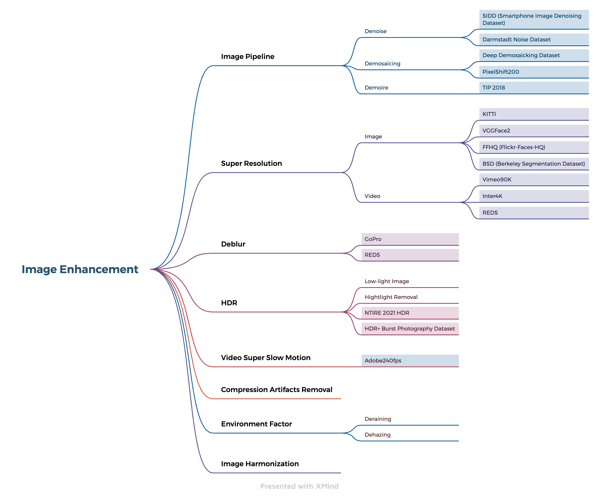
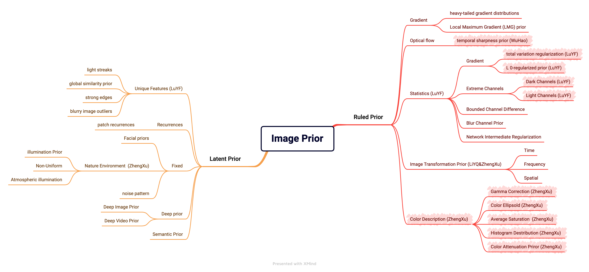

<!--A curated list of resources for Image and Video Deblurring-->
<!-- PROJECT LOGO -->

  <h3 align="center">Awesome-Image-Prior</h3>
  
A curated list of resources for Prior in Image or Video 
     
     
     
    <a href="https://github.com/yunfanLu/Awesome-Image-Prior/pulls/new">Suggest new item</a>
     
    <a href="https://github.com/yunfanLu/Awesome-Image-Prior/issues/new">Report Bug</a>
  

# Image Enhancement Classification

# Prior Classification

# 1.Handcrafted Prior

## 1.1 Regularization

### 1.1.1 Total Variation Regularization

**Definition:** Total variation regularization or total variation filtering, is a noise removal process (filter). It is based on the principle that signals with excessive and possibly spurious detail have high total variation, that is, the integral of the absolute image gradient is high. 

**Tasks:** Deblur; 

|Task|Title|Conference|
| ---- | ------------------------------------------------------------ | ---------- |
| Deblur | Total variation blind deconvolution | TIP  |

### 1.1.2 L 0-regularized prior

**Definintion:** L 0-regularized describes the sparsity of image pixels.

**Task:** Deblur; Dehazing;

|Task|Title|Conference|
| ---- | ------------------------------------------------------------ | ---------- |
| Deblur | Unnatural L 0sparse representation for natural image deblurring | CVPR 2013 |
| Deblur | L 0-regularized intensity and gradient prior for deblurring text images and beyond | PAMI 2016 |

## 1.2 Gradient

### 1.2.1 Heavy-tailed gradient distributions

**Definition:**

**Task:** Deblur;

|Task|Title|Conference|
| ---- | ------------------------------------------------------------ | ---------- |
| Deblur | Removing camera shake from a single photograph              | SIGGRAPH 2006 |
| Deblur | Understanding and evaluating blind deconvolution algorithms | CVPR 2009     |

### 1.2.2 Local Maximum Gradient (LMG) prior

## 1.3  Optical flow

**Definition:** Optical flow or optic flow is the pattern of apparent motion of objects, surfaces, and edges in a visual scene caused by the relative motion between an observer and a scene. 

**Tasks:** Deblur; Image/Video SR;

|Task|Title|Conference|
|-|-|-|
|Optical flow|Flownet: Learning optical flow with convolutional networks|ICCV 2015|
|Optical flow|FlowNet 2.0: Evolution of Optical Flow Estimation With Deep Networks|CVPR 2017|
|Optical flow|Optical Flow Estimation using a Spatial Pyramid Network|CVPR 2017| 
| Super-resolution   | Frame-Recurrent Video Super-Resolution                       | CVPR 2018  |
| Super-resolution   | Video Enhancement with Task-Oriented Flow                    | IJCV 2019  |
| Super-resolution |TDAN: Temporally Deformable Alignment Network for Video Super-Resolution|CVPR 2018|
| Super-resolution |EDVR: Video Restoration With Enhanced Deformable Convolutional Networks|CVPR 2019|
| Super-resolution   | BasicVSR: The Search for Essential Components in Video Super-Resolution and Beyond | CVPR 2021  |
| Super-resolution   | BasicVSR++: Improving Video Super-Resolution with Enhanced Propagation and Alignment | NTIRE 2021 |
|Super-resolution |VRT: A Video Restoration Transformer|Arxiv 2022|

### 1.3.1 Temporal sharpness prior

## 1.4 Data Description

### 1.4.1 RGB to Wavelet

### 1.4.2 RGB to frequency

### 1.4.3 Facial prior

## 1.5 Color Description

### 1.5.1Gamma Correction

### 1.5.2 Color Ellipsold 

### 1.5.3 Average Saturation

### 1.5.4 Histogram Destribution 

### 1.5.5 Color Attenuation Priro

# 2. Latent Prior

## 2.1 Patten

### 2.1.1 Light Streaks

### 2.1.2 Global Similarity Prior

### 2.1.3 Strong Edges

### 2.1.4 Blurry Image Outlies

## 2.2 Recurrences

### 2.2.1 Patch Recurrences

**Definition:**

**Tasks:** Image/Video SR;

|Task|Title|Conference|
| ---- | ------------------------------------------------------------ | ---------- |
| SR   | Super-resolution from a single image | CVPR 2009 |

## 2.3 Scienes

### 2.3.1 3D facial Prior

**Definition:** Utilize the 3D information of the face for human

**Tasks:** Deblur;

|Task|Title|Conference|
| ---- | ------------------------------------------------------------ | ---------- |
| Deblur | Face video deblurring using 3D facial priors | ICCV 2019 |

### 2.3.2 Nature Environment

#### 2.3.2.1 Illumination Prior

#### 2.3.2.2 Non-Uniform

#### 2.3.2.3 Atmospheric illumination

### 2.3.3 Noise Pattern

## 2.4 Statistics

### 2.4.1 Gradient Channels

### 2.4.2 Extreme Channels

#### 2.4.2.1 Dark Channels

**Defination:** The dark channel prior is a kind of statistics of outdoor haze-free images. It is based on a key observation—most local patches in outdoor haze-free images contain some pixels whose intensity is very low in at least one color channel.

**Tasks:** Deblur; Dehazing;

|Task|Title|Conference|
| ---- | ------------------------------------------------------------ | ---------- |
| Low Light Enhancement | Night video enhancement using improved dark channel prior    | 2013                             |
| Dehazing              | Unsupervised Single Image Dehazing Using Dark Channel Prior Loss | TIP2018                          |
| Dehazing              | Dehazing of remote sensing images using improved restoration model based dark channel prior | The Imaging Science Journal 2017 |

#### 2.4.2.2 Light Channels

### 2.4.3 Bounded Channel Difference

### 2.4.4 Blur Channel Prior

## 2.5 Deep Prior

### 2.5.1 Deep Image Prior

**Defination:** Deep Image Prior is a type of convolutional neural network used to enhance a given image with no prior training data other than the image itself. 

**Tasks:** Denoising; Image Restoration; HDR; 

|Task|Title|Conference|
| ---- | ------------------------------------------------------------ | ---------- |
| Denoise           | Patchdip exploiting patch redundancy in deep image prior for denoising | NIPS 2019    |
| Image Restoration | BP-DIP: A Backprojection based Deep Image Prior              | EUSIPCO 2020 |
| Image Restoration | Image restoration using total variation regularized deep image prior | ICASSP  2019 |
| Defense           | Exploring Properties of the Deep Image Prior                 | NIPS 2019    |
| HDR               | High dynamic range imaging using deep image priors           | 2020         |
| Denoise           | Deep Image Prior                                             | CVPR         |

### 2.5.2 Deep Video Prior

Definition: 

Tasks:

|Task|Title|Conference|
| ---- | ------------------------------------------------------------ | ---------- |
| Flickering Artifact | Blind video temporal consistency via deep video prior | NIPS 2020 |
|                     | Deep Video Prior                                      | NIPS 2020 |

## 2.6 Semantic

# 3 Image Enhancement Task and Dataset

## 3.1 Denoise

**Definition:** Image Denoising is the task of removing noise from an image, e.g. the application of Gaussian noise to an image.

|Dataset|Description|Detail|Metric|
| ---------------------------------------- | ------------------------------------------------------- | ------------------------------------------------------------ | ---- |
| SIDD(Smartphone Image Denoising Dataset) | A High-Quality Denoising Dataset for Smartphone Cameras | 30,000 noisy images from 10 scenes                           | PSNR |
| Image Denoising on DND                   | Benchmarking Denoising Algorithms with Real Photographs | 50 pairs of noisy and (nearly) noise-free images,1000 patches with 512x512 | PSNR |

## 3.2 Demosaicing

**Definition:** A demosaicing (also de-mosaicing, demosaicking or debayering) algorithm is a digital image process used to reconstruct a full color image from the incomplete color samples output from an image sensor overlaid with a color filter array (CFA). It is also known as CFA interpolation or color reconstruction.

|Dataset|Description|Detail|Metric|
| ---------------------------------------- | ------------------------------------------------------- | ------------------------------------------------------------ | ---- |
| Deep Demosaicking Dataset | Deep Joint Demosaicking and Denoising                        |                                                              | PSNR |
| PixelShift200             | Rethinking the Pipeline of Demosaicing, Denoising and Super-Resolution | Training: 200 images Testing: 10 images Key Features: fully colored, demosiacing artifacts free Camera: SONY α7R III | PSNR |

## 3.3 Demoire

**Definition:**  In television and digital photography, a pattern on an object being photographed can interfere with the shape of the light sensors to generate unwanted artifacts. 

|Dataset|Description|Detail|Metric|
| ---------------------------------------- | ------------------------------------------------------- | ------------------------------------------------------------ | ---- |
| TIP 2018 | Moiré Photo Restoration Using Multiresolution Convolutional Neural Networks | 135,000 image pairs | PSNR |

## 3.4 Image Super Resolution 

**Definition:**Image Super Resolution refers to the task of enhancing the resolution of an image from low-resolution (LR) to high (HR). 

|Dataset|Description|Detail|Metric|
| ---------------------------------------- | ------------------------------------------------------- | ------------------------------------------------------------ | ---- |
| KITTI                               | Are we ready for autonomous driving? The KITTI vision benchmark suite | 323 images;46 testing images;                          | PSNR |
| BSD (Berkeley Segmentation Dataset) | A Database of Human Segmented Natural Images and its Application to Evaluating Segmentation Algorithms and Measuring Ecological Statistics | 100 test images                                        | PSNR |
| FFHQ (Flickr-Faces-HQ)              | A Style-Based Generator Architecture for Generative Adversarial Networks | 70,000 high-quality PNG images at 1024×1024 resolution | PSNR |
| VGGFace2                            | VGGFace2: A dataset for recognising faces across pose and age | 3.31 million images                                    | PSNR |

## 3.5 Video SR

**Definition:** Video super-resolution is the task of upscaling a video from a low-resolution to a high-resolution.

|Dataset|Description|Detail|Metric|
| ---------------------------------------- | ------------------------------------------------------- | ------------------------------------------------------------ | ---- |
| Vimeo90K | Video Enhancement with Task-Oriented Flow                    | a large-scale high-quality video dataset                     | PSRN |
| Inter4K  | AdaPool: Exponential Adaptive Pooling for Information-Retaining Downsampling | 1,000 ultra-high resolution videos with 60 frames per second (fps) from online resources. | PSNR |
| REDS     | NTIRE 2019 Challenge on Video Super-Resolution: Methods and Results | 300 video sequences with resolution of 720×1,280             | PSNR |

## 3.6 Deblur 

**Definition:** Deblurring is the process of removing blurring artifacts from images. Deblurring recovers a sharp image S from a blurred image B, where S is convolved with K (the blur kernel) to generate B. Mathematically, this can be represented as B=S*K  (where * represents convolution).

| GoPro | Deep Multi-scale Convolutional Neural Network for Dynamic Scene Deblurring | 3,214 blurred images with the size of 1,280×720  | PSNR |
| ----- | ------------------------------------------------------------ | ------------------------------------------------ | ---- |
| REDS  | NTIRE 2019 Challenge on Video Deblurring: Methods and Results;NTIRE 2021 Challenge on Image Deblurring | 300 video sequences with resolution of 720×1,280 | PSNR |
| DVD   | Deep Video Deblurring for Hand-held Cameras                  | 71 videos                                        | PSNR |

## 3.7 HDR

**Definition:** HDR capture is a technique allowing to capture high dynamic range (HDR) images by taking and then combining several different exposures of the same subject matter.

|Dataset|Description|Detail|Metric|
| ---------------------------------------- | ------------------------------------------------------- | ------------------------------------------------------------ | ---- |
| NTIRE 2021 HDR                 | NTIRE 2021 Challenge on High Dynamic Range Imaging: Dataset, Methods and Results |                                                        | PSNR |
| HDR+ Burst Photography Dataset | Burst photography for high dynamic range and low-light imaging on mobile cameras | **3640 bursts** (made up of **28461 images** in total) | PSNR |

## 3.8 Video Super Slow Motion

**Definition:** Motion interpolation or motion-compensated frame interpolation (MCFI) is a form of video processing in which intermediate animation frames are generated between existing ones by means of interpolation, in an attempt to make animation more fluid, to compensate for display motion blur, and for fake slow motion effects.

|Dataset|Description|Detail|Metric|
| ---------------------------------------- | ------------------------------------------------------- | ------------------------------------------------------------ | ---- |
| Adobe240 fps | Super SloMo: High Quality Estimation of Multiple Intermediate Frames for Video Interpolation | 1,132 video clips with 240-fps | PSNR |

